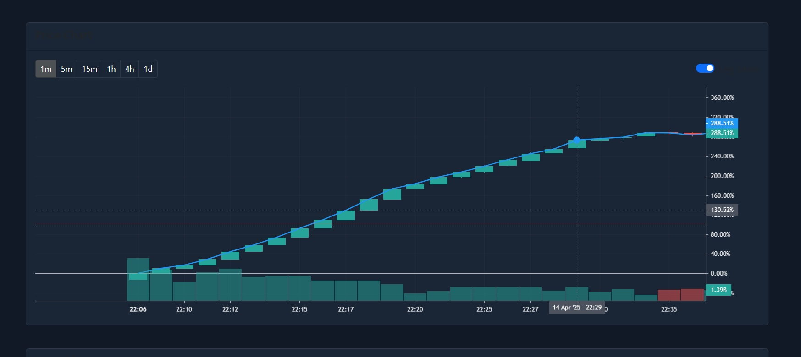
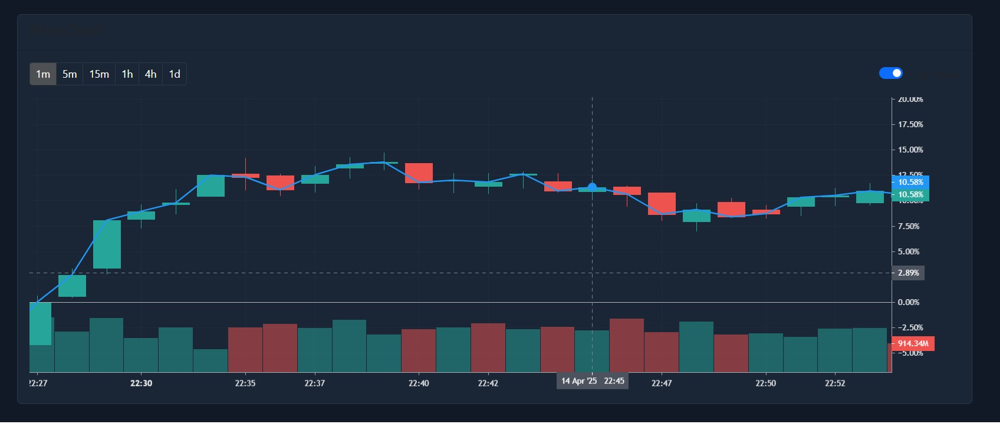

# 🚀 DEX Volume Bot Pro – Educational Edition 📈

**Simulate Realistic Market Activity on Any DEX – For Training and Educational Use Only**  
📊 _Create professional-looking charts, practice market behavior modeling, and explore algorithmic strategies in a safe test environment._

---

*Example of 📈 Pump Mode generating a healthy, organic growth curve.*

---

## ✨ Features

🔹 **5 Human-Inspired Trading Profiles**  
Create behavior-rich simulations using built-in profiles:  
👤 Frequent | ⏰ Regular | 🛡️ Cautious | 🎯 Opportunistic | 🎲 Sporadic

🔹 **Advanced Multi-Mode Trading**  
- 🟢 **PUMP Mode:** Simulates steady buying activity  
- 🔴 **DUMP Mode:** Simulates selling patterns  
- ⚖️ **NORMAL Mode:** Mixes realistic buys and sells based on selected behavior

🔹 **Fully Configurable Pools**  
💧 Connect to **any EVM-compatible liquidity pool**, including custom/private networks. Tokens and routers are auto-detected.

🔹 **Precise Volume Control**  
📅 Spread simulated trading volume **across timeframes**, from minutes to days  
🧮 Use the built-in calculator to set trade frequency and intensity

🔹 **Unlimited Scalability**  
🧵 Thread-based parallel execution allows **up to 100+ wallets** trading simultaneously – fully automated  
💼 Ideal for educational testing of **multi-agent behavior**

🔹 **Cross-Chain Ready**  
✅ Supports **Ethereum, BSC, Polygon, Avalanche, Arbitrum, Optimism**, and more  
🧪 Works with testnets & private chains

---

## ⚙️ Professional Tools

🧠 **Smart Faucet Distribution**  
Send ETH or native tokens to all training wallets with one click

🔄 **Position Management**  
- 🔓 One-click unwrap of WETH  
- 🔁 Recovery function: sends all remaining balance back to master wallet

📊 **Live Analytics Dashboard**  
- Realtime wallet activity  
- Pool volume metrics  
- Gas cost tracking

⚙️ **Custom Trading Parameters**  
Set slippage, gas strategy, randomness, trade size variance and more to simulate complex trader behavior

---

*Simulated active trading over time, illustrating natural movement and balance.*

---

## 🛡️ Disclaimer

📚 This bot is provided **strictly for educational and simulation purposes**.  
It is designed to help developers and blockchain enthusiasts understand market behavior, test algorithmic strategies, and visualize token trading impact in a **controlled, non-financial environment**.

We do **not encourage** or endorse any form of misuse. Always respect local laws and platform guidelines.

---

## 📬 Contact

💬 Telegram Support & Inquiries: [@tradingboteducational](https://t.me/tradingboteducational)

---

> ⚠️ For educational use only. Always simulate responsibly.

#DEX

#TradingBot

#BlockchainSimulation

#EducationalTools

#CryptoTrading

#MarketSimulation

#EVM

#MultiChain

#Ethereum

#CryptoBot

#AutomatedTrading

#TokenTrading

#LiquidityPools

#AlgorithmicTrading

#CryptoDev

#Testnet

#SmartContracts

#Simulations
