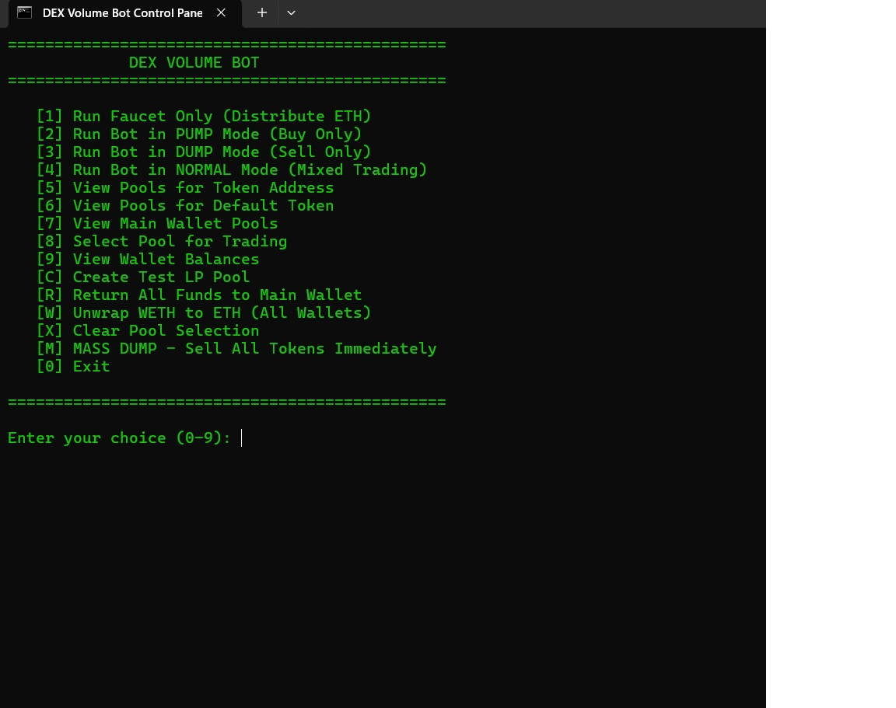
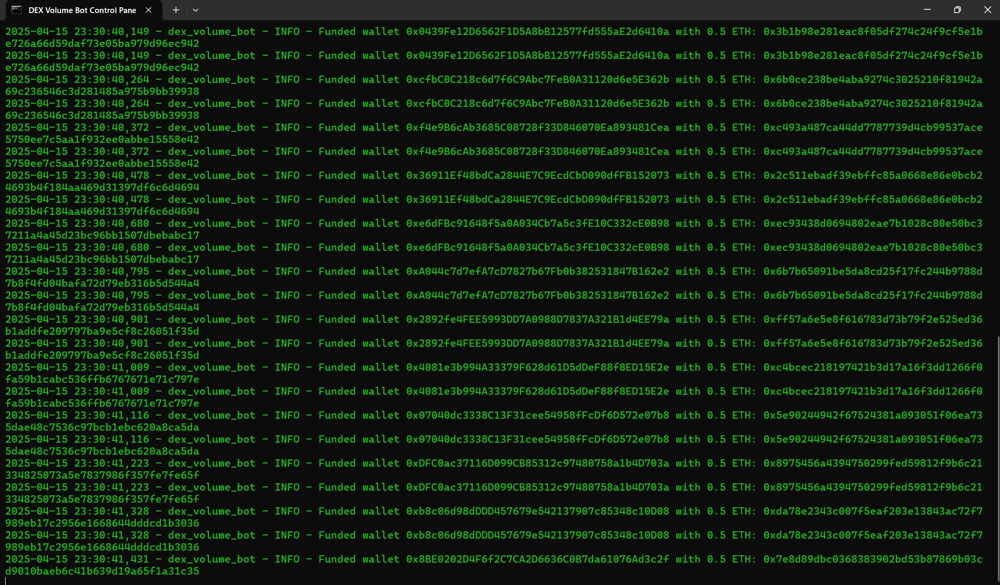
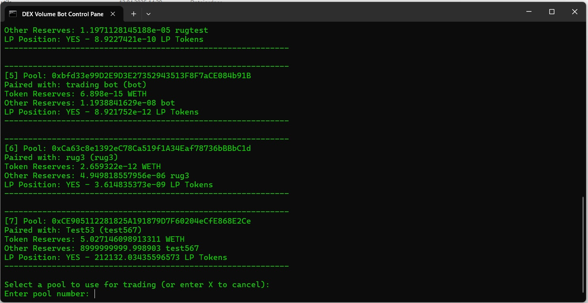

# 🚀 DEX Volume Bot Pro – Educational Edition 📈

**Simulate Realistic Market Behavior on Any DEX – For Training and Educational Use Only**  
📊 _Build smart charts, test liquidity scenarios, and explore automated strategies in a safe, non-financial environment._

---

  
*A powerful, keyboard-driven control panel. Clean. Fast. Efficient.*

---

## ✨ Key Features

🔹 **5 Human-Inspired Trading Profiles**  
Choose from 5 behavioral presets that simulate real user activity:  
👤 Frequent | ⏰ Regular | 🛡️ Cautious | 🎯 Opportunistic | 🎲 Sporadic

🔹 **Three Trading Modes**  
- 🟢 **PUMP Mode** – Simulate steady, organic buy pressure  
- 🔴 **DUMP Mode** – Test how DEXs react to realistic sell behavior  
- ⚖️ **NORMAL Mode** – Balanced buy/sell activity with human-like randomness

> ✅ All modes are designed for educational and simulation purposes only.

🔹 **Cross-Chain Support**  
Connect to any **EVM-compatible chain**: Ethereum, BSC, Arbitrum, Polygon, Avalanche, Optimism, even custom/private chains.

🔹 **Custom Pool Support**  
Paste any LP or token address – token detection, WETH wrapping, and pair info handled automatically.

🔹 **Scheduled Volume Simulation**  
Use the built-in calculator to define exact volume goals across hours or days.

🔹 **Unlimited Scalability**  
Run 100+ wallets in parallel with thread-based execution – hardware is the only limit.

---

  
*Smart faucet: Send native tokens to dozens of wallets in one go.*

---

## ⚙️ Pro Tools & Controls

🧠 **Faucet Tool** – Bulk-send ETH or any native token  
🔄 **Recovery Module** – Sweep all remaining balances back to your main wallet  
🔓 **WETH Unwrap** – Instantly unwrap WETH from all trading wallets  
📊 **Live Monitoring** – Track trade activity, volume, gas spent, and more  
⚙️ **Custom Settings** – Fine-tune gas, slippage, trade size, and timing

---

  
*Interactive pool selection: view tokens, liquidity, and router info.*

---

## 💻 Easy to Run – Cross-Platform

🪟 **Windows Ready** – Launch instantly via `.bat` file, no CLI skills needed  
🐧 **Linux Compatible** – Full support for CLI-based execution on Linux/Ubuntu servers  
⚙️ Designed to run on both personal desktops and cloud-based environments

---

## 📦 Requirements

The bot uses modern Python modules to ensure reliability and performance.  
Before you start, make sure you have Python 3.10+ and install the dependencies:

📄 **See:** [`requirements.txt`](./requirements.txt)

```bash
pip install -r requirements.txt
⚠️ Important: If you're not able to install these dependencies, this tool is not for you.
This software is intended for advanced users with basic Python and system setup knowledge.

🧪 Use Cases (for Educational Simulation)
🧠 Learn how volume affects chart movement

🧪 Test token behavior pre-launch

📈 Simulate healthy or stressful market conditions

🧰 Build and evaluate automation strategies

👥 Train devs, teams, and communities on volume dynamics

🛡️ Legal Disclaimer
This software is provided strictly for educational and testing purposes.
We do not support or promote illegal, malicious, or manipulative use.
Always comply with local laws and platform regulations. Use responsibly.

📬 Contact & Access
💬 Telegram: @tradingboteducational
🛠️ Setup support, live walkthroughs, and testnet guidance available.

⚠️ Learn responsibly. Simulate smart. Stay ethical.
